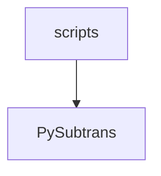

# LLM-Subtrans Architecture (CLI Edition)

This document helps developers understand where to find code and how components interact when working on the codebase.

**Note:** This is a CLI-only fork for Linux/macOS. All GUI and Windows-specific components have been removed.

## Entry Points

| Script | Purpose |
|--------|---------|
| `scripts/llm-subtrans.py` | CLI translator - loads subtitle file, translates using specified provider/model, saves results |
| `scripts/batch-translate.py` | Batch translation script for processing multiple files |

## Module Structure

### PySubtrans (Core Engine)
Contains all subtitle processing, translation logic, and project management. This is where you'll find:
- Translation algorithms and providers
- Project state management
- Settings and configuration
- File format support and parsing

**Key Classes:**
- `Subtitles` – container for subtitle data with thread-safe access patterns
- `SubtitleScene`, `SubtitleBatch` – hierarchical organization splitting files into manageable translation units
- `SubtitleLine` – represents individual subtitles with timing, text, and translation data
- `Options` – centralized settings management
- `SubtitleProject` – orchestrator managing translation sessions and project persistence
- `SubtitleTranslator` – executes translation jobs, handles retries and errors
- `TranslationProvider` – base class for pluggable backends (OpenAI, Anthropic, etc.)
- `SubtitleBuilder` – fluent API for programmatically building subtitle structures
- `SubtitleEditor` – handles mutation operations on subtitle data with thread safety

### Subtitle Format Handling
Subtitle files are processed through a pluggable system:
- `SubtitleFileHandler` implementations read and write specific formats while exposing a common interface.
- `SubtitleFormatRegistry` loads handlers from `PySubtrans/Formats/` and maps file extensions to the appropriate handler based on priority.
- `SubtitleProject` uses the registry to detect formats from filenames and can convert subtitles when the output extension differs from the source.

## Data Organization

### Data Hierarchy
- `Subtitles` – top-level container with subtitle content and metadata, provides thread-safe access to scenes and lines
- `SubtitleScene` – a time-sliced section of subtitles, grouped into batches
- `SubtitleBatch` – groups of lines within a scene, split into chunks for translation
- `SubtitleLine` – individual subtitle with index, timing, text and metadata

### SubtitleProject
Manages translation sessions and project persistence. It orchestrates loading subtitle files, saving/loading `.subtrans` project files (JSON format containing subtitles, translations, and metadata), and coordinates project settings management.

### SubtitleBatcher
Pre-processes subtitles to divide them into scenes and batches ready for translation. Scene detection threshold and maximum batch size are configurable.

### SubtitleBuilder
The `SubtitleBuilder` class provides a fluent API for constructing `Subtitles`.
- Automatic scene and batch organization based on configurable size limits
- Integration with `SubtitleBatcher` for intelligent scene subdivision

### SubtitleEditor
Mutation operations on subtitle data should go through the `SubtitleEditor` class to ensure proper thread safety when adding/removing/merging/splitting scenes, batches and lines.

Also provides methods for preprocessing, auto-batching and data sanitization.

## Translation Process

**SubtitleTranslator** manages the translation pipeline:
- Splits `Subtitles` into scenes and batches for processing
- Builds prompts with context for each batch
- Delegates to `TranslationProvider` clients for API calls
- Handles retries, error management and post-processing
- Emits `TranslationEvents` with progress updates

### TranslationProvider System
- Pluggable base class with providers in `PySubtrans/Providers/` that register at startup
- Each provider exposes available models and creates an appropriate `TranslationClient`
- `TranslationClient` handles API communication specifics (authentication, request format, parsing)
- The provider can also provide a custom `TranslationParser` if a non-standard response format is expected
   
## Command-Line Architecture

The command-line interface provides simple synchronous processing of a source file.

1. **Argument parsing** – allows configuration via command line arguments.
2. **Options creation** – Parsed arguments and environment variables are merged to produce an `Options` instance that configures the translation flow.
3. **Project initialization** – `CreateProject` loads the source subtitles and prepares them for translation, and initialises a `SubtitleTranslator`, optionally reading/writing a project file.
4. **Completion** the resulting translation is saved, and the optional project file is updated.

## Settings Management
Application settings are managed through a layered system:

**`SettingsType`** - generic type-safe settings container
- Provides typed getters (`get_str`, `get_int`, `get_bool`) and convenience properties

**`PySubtrans.Options`**
- application-specific `SettingsType`
- Provides default values for all application settings
- Loads settings from a `settings.json` file
- Import settings from environment variables and command line arguments
- Supports project-specific and provider-specific settings

## Translation Provider Architecture
The application supports multiple translation services through a provider system.

### TranslationProvider (Configuration Layer)
Each `TranslationProvider` subclass serves as the registry entry for a translation service and offers:

- **`available_models`**: property containing available models that can be selected
- **GetTranslationClient**: creates an appropriate client for API communication
- **GetOptions**: Defines provider-specific options (API key, endpoints, etc.)

### TranslationClient (Communication Layer)
The `TranslationClient` defines the API communication interface:

- **`BuildTranslationPrompt()`** – constructs the prompt sent to the translation service
- **`RequestTranslation()`** – handles the API call and returns a `Translation` object
- **`GetParser()`** – returns a `TranslationParser` to extract translated text from the response
- **`supports_streaming`** – property indicating if the client supports streaming responses

#### Streaming Response Support
Several translation clients support streaming responses for real-time translation updates:

**Supported Providers:**
- **OpenAI (Reasoning Models)** (`OpenAIReasoningClient`) - Uses OpenAI's streaming API with event-based response handling
- **Claude** (`AnthropicClient`) - Supports streaming via Anthropic's streaming API
- **Gemini** (`GeminiClient`) - Uses Google's streaming response format
- **Custom Server** (`CustomClient`) - Handles Server-Sent Events (SSE) with robust parsing
- **OpenRouter/DeepSeek** (`OpenRouterClient`, `DeepSeekClient`) - `CustomClient` with streaming support

**Streaming Architecture:**
- **`TranslationRequest`** class encapsulates streaming state and logic to maintain stateless clients
- **Event-driven updates** via `batch_updated` signal for partial translations
- **Delta accumulation** processes streaming text chunks and detects complete line groups

**Key Methods:**
- **`ProcessStreamingDelta(delta_text)`** – processes incoming streaming text chunks
- **`_emit_partial_update()`** – emits partial translation updates to the GUI
- **`_has_complete_line_group()`** – detects when enough content has accumulated for an update

**Configuration:**
Streaming can be enabled via provider settings:
- `stream_responses` (bool) setting appears in provider options for supported clients
- Streaming is opt-in and gracefully falls back to non-streaming for unsupported models

### Adding New Providers
To add a new provider:
1. Create a new module in `PySubtrans/Providers/` with a `TranslationProvider` subclass
2. Add an import statement for the new module in `PySubtrans/Providers/__init__.py`

The provider will then automatically register at startup and its settings will be added to `SettingsDialog`.

### Prompt Construction and Response Parsing
The specific format for translation requests can vary by provider and responses can be inconsistent, so two helper classes exist to manage the differences between capabilities and expectations.

**`TranslationPrompt`** builds context-rich prompts by combining:
- User instructions and translation guidelines
- Subtitle lines to be translated  
- Scene/batch summaries and character information for context
- Configurable templates

**`TranslationParser`** extracts translations from LLM responses:
- Uses multiple regex patterns to attempt to extract translated lines from the response
- Matches extracted translations back to source subtitle lines
- Extracts additional metadata
- Validates results (line length, formatting rules) and triggers retries if needed

## Extending the System

- **New file formats** → `PySubtrans/Formats/` (add file handler, extend `SubtitleFileHandler`, add import to `__init__.py`)
- **Translation providers** → `PySubtrans/Providers/` (subclass `TranslationProvider` and `TranslationClient`, add import to `__init__.py`)
- **Settings** → update `Options` schema and default values
- **CLI scripts** → add new scripts in `scripts/` directory for additional functionality

**Key principles:**
- All subtitle mutations should use a `SubtitleEditor` for lock management and thread safety.
